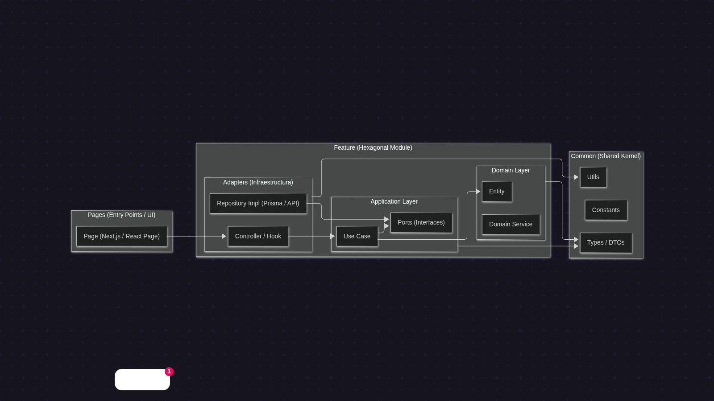
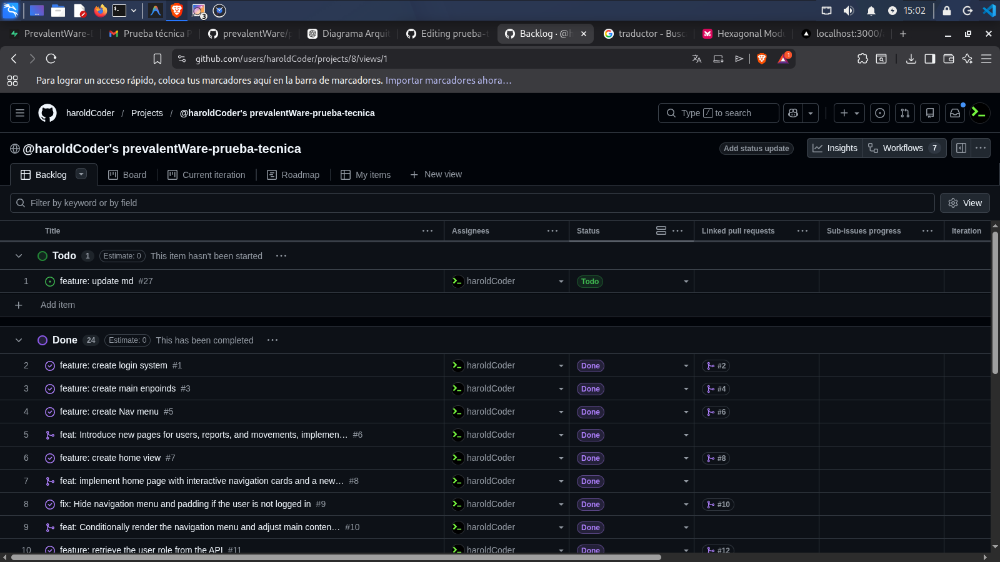

# Sistema de Gestión de Ingresos y Egresos PrevalentWare

## Introducción

Bienvenido al **Sistema de Gestión de Ingresos y Egresos PrevalentWare**. Esta aplicación Fullstack está diseñada para ayudar a las organizaciones a realizar un seguimiento de los movimientos financieros, gestionar usuarios y generar reportes detallados. Cuenta con una arquitectura moderna, segura y robusta, aprovechando el poder de **Next.js**, **Supabase** y la **Arquitectura Hexagonal**.

Características principales:
- **Gestión Financiera:** Seguimiento de ingresos y egresos con metadatos detallados (concepto, monto, fecha, usuario).
- **Gestión de Usuarios:** Herramientas exclusivas para administradores para gestionar usuarios y roles.
- **Reportes:** Análisis visual y capacidades de exportación a CSV.
- **Control de Acceso Basado en Roles (RBAC):** Acceso seguro con roles de 'Admin' y 'Usuario'.

 <!-- Reemplazar con una imagen de vista previa real si está disponible -->

---

## 🚀 Comenzando

Sigue estas instrucciones para configurar el proyecto localmente para desarrollo.

### Requisitos Previos
- Node.js (v18+ recomendado)
- npm o yarn
- PostgreSQL (o una instancia de Supabase)

### Instalación

1.  **Clonar el repositorio:**
    ```bash
    git clone <url_del_repositorio>
    cd <carpeta_del_repositorio>
    ```

2.  **Instalar dependencias:**
    ```bash
    npm install
    ```

3.  **Configuración del Entorno:**
    Crea un archivo `.env` en el directorio raíz y configura las variables de tu base de datos y autenticación (consulta `.env.example` si está disponible).

4.  **Ejecutar Servidor de Desarrollo:**
    ```bash
    npm run dev
    ```
    La aplicación estará disponible en [http://localhost:3000](http://localhost:3000).

---

## 🧪 Pruebas

Aseguramos la calidad del código mediante pruebas rigurosas de API y End-to-End (E2E).

### Pruebas Unitarias y de API
Ejecuta la suite de pruebas Jest para verificar la lógica del backend y los endpoints de la API:
```bash
npm run test
```

### Pruebas End-to-End (E2E)
Utilizamos **Cypress** para pruebas de integración full-stack.

Para abrir el corredor de pruebas interactivo de Cypress:
```bash
npm run cypress:open
```

Para ejecutar pruebas en modo headless (útil para CI/CD):
```bash
npm run cypress:run
```

---

## ☁️ Despliegue

Este proyecto está optimizado para su despliegue en **Vercel**. Puedes desplegarlo utilizando la interfaz web o mediante la consola (**Vercel CLI**).

### Desplegando con Vercel CLI (Consola)

1. **Instalar Vercel CLI globalmente:**
   ```bash
   npm install -g vercel
   ```

2. **Iniciar sesión:**
   ```bash
   vercel login
   ```

3. **Desplegar el proyecto:**
   Ejecuta el siguiente comando en la raíz del proyecto y sigue las instrucciones:
   ```bash
   vercel
   ```

4. **Desplegar a producción:**
   Una vez configurado, puedes desplegar la versión de producción con:
   ```bash
   vercel --prod
   ```

### Desplegando desde la Interfaz Web

1. Sube tu código a un repositorio de GitHub.
2. Inicia sesión en [Vercel](https://vercel.com/) y haz clic en **"New Project"**.
3. Importa tu repositorio de GitHub.
4. Configura las **Variables de Entorno** en el panel de Vercel (replica tu configuración local de `.env`).
5. Haz clic en **"Deploy"**.

Vercel construirá y desplegará automáticamente tu aplicación Next.js.

---

## 🏗️ Arquitectura

Este proyecto sigue un patrón de **Arquitectura Hexagonal (Puertos y Adaptadores)** para asegurar la separación de responsabilidades, escalabilidad y mantenibilidad.

### Resumen de la Estructura

- **Capa de Dominio (Domain Layer):** Contiene reglas de negocio y entidades específicas de la empresa. Está aislada de frameworks externos.
- **Capa de Aplicación (Application Layer):** Contiene casos de uso que orquestan el flujo de datos hacia y desde las entidades de dominio.
- **Capa de Infraestructura (Infrastructure Layer):** Implementa interfaces definidas por el dominio (repositorios, adaptadores de base de datos, servicios externos).
- **Capa de Presentación (Presentation Layer/UI):** Componentes React y páginas Next.js que interactúan con la capa de aplicación.

**Diagrama:**



> El diagrama anterior ilustra cómo la lógica de negocio central permanece independiente de tecnologías externas como la base de datos o la interfaz de usuario.

---

## 📅 Planeación

El proceso de desarrollo siguió una fase de planificación estructurada.

**Diagrama de Planeación:**


> Solo el rol de Admin puede acceder a las funciones completas de reportes y gestión de usuarios, como se ilustra en el flujo.

---

## 📋 Backlog

Hacemos seguimiento de nuestro progreso, funcionalidades y errores utilizando un Tablero de Proyecto de GitHub. Puedes ver el estado actual y la hoja de ruta aquí:

👉 **[Ver Backlog del Proyecto](https://github.com/users/haroldCoder/projects/8/views/1)**



---

**Nota:** Para los requisitos originales de la prueba técnica, por favor consulta [REQUIREMENTS.md](./REQUIREMENTS.md).
